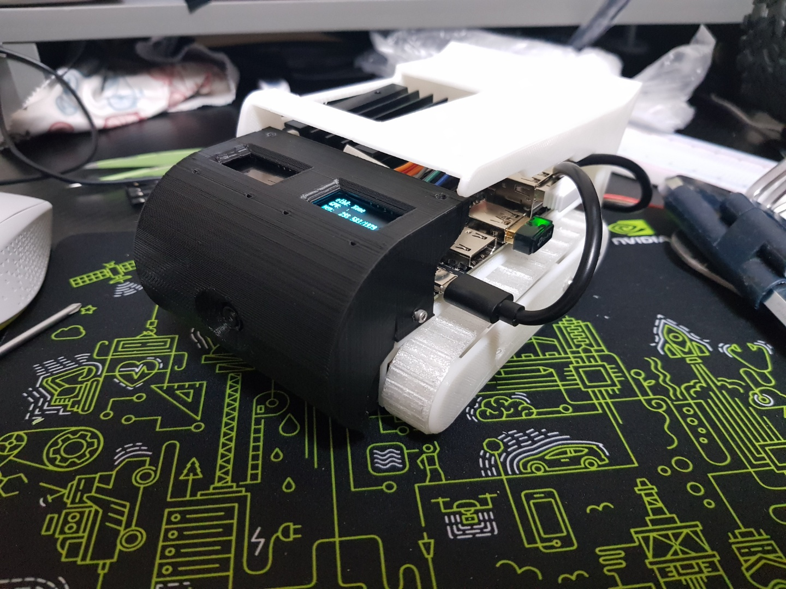

# Nanosaur by Road Balance
| 🦕 The smallest NVIDIA Jetson dinosaur robot 🦖 - Reborn by Road Balance

<p align="center">
    
</p>

---

```
pip3 install wheel setuptools Adafruit_MotorHat
pip3 install -U wstool

cd /opt && \
    git clone https://github.com/dusty-nv/jetson-utils.git && \
    mkdir -p jetson-utils/build && cd jetson-utils/build && \
    cmake ../ && \
    make -j$(nproc) && \
    make install && \
    ldconfig
```

```
colcon build
. install/setup.bash
ros2 run nanosaur_hardware nanosaur

sudo apt-get install ros-eloquent-teleop-twist-keyboard

ros2 topic pub /cmd_vel geometry_msgs/msg/Twist "{linear: {x: 2.0, y: 0.0, z: 0.0}, angular: {x: 0.0, y: 0.0, z: 1.8}}"


mkdir -p ~/ros2_ws/src
cd ~/ros2_ws/src
cd ../
colcon build

```

## oled test

```
git clone https://github.com/JetsonHacksNano/installPiOLED
cd installPiOLED
./installPiOLED

cd pioled
sudo python3 stats.py

27 28 
$ sudo i2cdetect -y -r 0
     0  1  2  3  4  5  6  7  8  9  a  b  c  d  e  f
00:          -- -- -- -- -- -- -- -- -- -- -- -- -- 
10: -- -- -- -- -- -- -- -- -- -- -- -- -- -- -- -- 
20: -- -- -- -- -- -- -- -- -- -- -- -- -- -- -- -- 
30: -- -- -- -- -- -- -- -- -- -- -- -- 3c -- -- -- 
40: -- -- -- -- -- -- -- -- -- -- -- -- -- -- -- -- 
50: -- -- -- -- -- -- -- -- -- -- -- -- -- -- -- -- 
60: -- -- -- -- -- -- -- -- -- -- -- -- -- -- -- -- 
70: -- -- -- -- -- -- -- --

disp = Adafruit_SSD1306.SSD1306_128_32(rst=None, i2c_bus=0, gpio=1, i2c_address=0x3C)
```


## motor test

```
$ sudo i2cdetect -y -r 1
     0  1  2  3  4  5  6  7  8  9  a  b  c  d  e  f
00:          -- -- -- -- -- -- -- -- -- -- -- -- -- 
10: -- -- -- -- -- -- -- -- -- -- -- -- -- -- -- -- 
20: -- -- -- -- -- -- -- -- -- -- -- -- -- -- -- -- 
30: -- -- -- -- -- -- -- -- -- -- -- -- -- -- -- -- 
40: -- -- -- -- -- -- -- -- -- -- -- -- -- -- -- -- 
50: -- -- -- -- -- -- -- -- -- -- -- -- -- -- -- -- 
60: 60 -- -- -- -- -- -- -- -- -- -- -- -- -- -- -- 
70: 70 -- -- -- -- -- -- --

sudo python3 motor_test.py
```

## RPI Cam

```
free -m

# Disable ZRAM:
sudo systemctl disable nvzramconfig

# https://youtu.be/uvU8AXY1170?t=732

# Create 4GB swap file
sudo fallocate -l 4G /mnt/4GB.swap
sudo chmod 600 /mnt/4GB.swap
sudo mkswap /mnt/4GB.swap

# Append the following line to /etc/fstab
sudo vi /etc/fstab
sudo echo "/mnt/4GB.swap swap swap defaults 0 0" >> /etc/fstab

# REBOOT!

free -m
              total        used        free      shared  buff/cache   available
Mem:           3956         865        2551          29         539        2907
Swap:          4095           0        4095
```


```
sudo apt-get install ros-eloquent-teleop-twist-keyboard
ros2 run teleop_twist_keyboard teleop_twist_keyboard


colcon build --symlink-install --packages-select nanosaur_hardware
. install\setup.bash
ros2 run nanosaur_hardware nanosaur

```

# Creator

* Design by Yoon Yohan
* Progamming by Kimsooyoung
